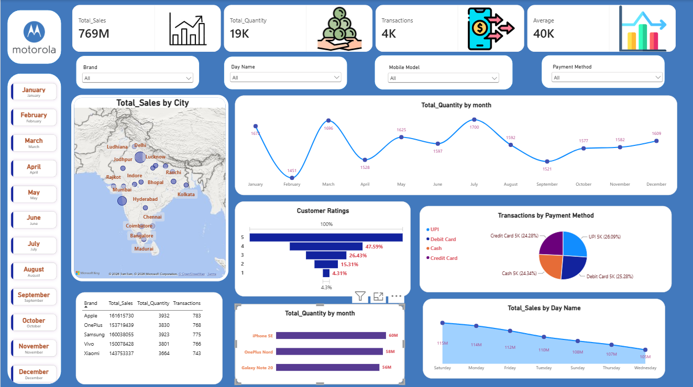

# 📊 Motorola Sales Dashboard | Power BI

An interactive **Power BI dashboard** designed to analyze sales performance across products, cities, months, payment methods, and customer ratings.

## 📸 Dashboard Preview

## 🎯 Project Overview

This project transforms sales data into an interactive dashboard to track KPIs and identify important sales patterns.

### 📊 Key Metrics
- 💰 Total Sales: **769M**
- 📦 Total Quantity: **19K**
- 🧾 Transactions: **4K**
- 📈 Average: **40K**

### 🔍 Dashboard Features
- City-wise sales analysis
- Monthly quantity trends
- Product performance
- Customer rating analysis
- Payment method analysis
- Day-wise sales analysis
- Interactive filters for Month, Brand, Product & Payment Method

## 🛠️ Tools Used

**Power BI · Power Query · DAX · Data Modeling · Data Visualization**

